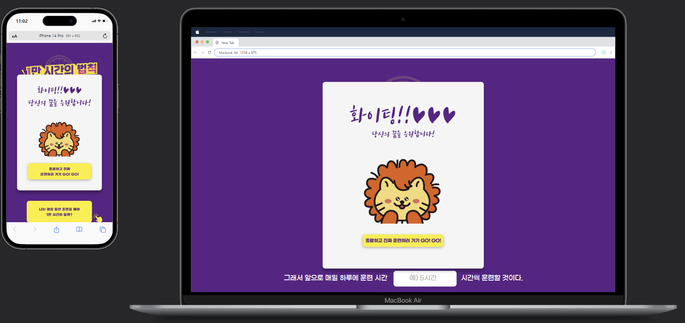

# 1만 시간의 법칙 #
> **프로젝트의 중점&목표**
> 1. 시멘틱한 태그를 사용하여 마크업 할 것
> 2. 피그마 디자인을 최대한 반영할 것
> 3. 반응형으로 대응 가능할 것
> 4. 웹 접근성을 점검할 것

***
## repo 구조 ##

```
프로젝트/
│
├── index.html         - 메인 HTML 파일
├── style.css          - 스타일시트
├── reset.css          - CSS 리셋(import됨)
└── img/               - 이미지 파일 디렉토리
    ├── click.png
    ├── clock.png
    ├── logo.png
    └── ...
```

## 구현 내용 ##
1. **메인 레이아웃**
  - 헤더/메인/푸터/모달로 구성
  - 메인 콘텐츠 내부를 6개로 나누어 각각 div로 묶음
2. **사용자 입력 요소**
- input 태그의 type을 지정하여 입력 창을 구현
  ```
  <p class="input-box-1">
          <label for="job">나는</label>
          <input
            type="text"
            name="job"
            id="job"
            placeholder="예) 프로그래밍" />전문가가 될 것이다.
      </p>
  ```
3. **반응형 구현**

